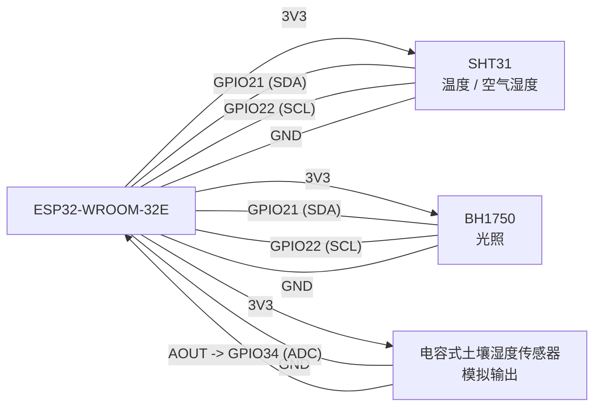

# 🌿 Plant Talk BLE (Main Branch - 云端同步与 AI 智体版)

> **项目一句话简介**：连接物理世界植物传感器（ESP32）与 AI 智能体的大模型软硬件结合系统，支持多端数据同步、DeepSeek/OpenAI 环境数据 Tool Call，以及 Qwen3.5-Omni 实时语音与摄像头多模态对话。

---

## ⚡ 项目核心亮点与特性（一目了然）

* 📡 **嵌入式硬件与可靠采集**：ESP32 定时读取温湿度（SHT31）、光照（BH1750）、土壤湿度（ADC），基于 LittleFS 实现断网环形存储与校时补发机制。
* ☁️ **多端双向云同步**：内置 Serverless 端（FC + Tablestore），支持 iOS 与 Web 多端数据的实时上传、拉取与墓碑（Tombstone）双向删除同步。
* 🤖 **AI 智体与环境 Tool Calling**：大模型可自主感知物理世界！内置环境数据 Tool Catalog，允许 DeepSeek / OpenAI / 千问直接查询当前的传感器实时数据与长短时历史趋势。
* 🎙️ **Qwen3.5-Omni 实时语音与多模态**：基于 WebRTC 协议实现低延时实时语音交互、服务端 VAD 自然语音打断、拍照及 1 FPS 连续摄像头实时画面感知。
* 🎨 **原生 SwiftUI 现代化交互**：流式 Markdown 回显、Liquid Glass 质感、自定义动画与可调参小球（Orb）视觉交互。

---

## 💡 启发式 AI Agent 提示词（复制给你的 AI 工具提问）

如果你正在使用 AI Agent（如 Antigravity / Claude / Cursor / ChatGPT）阅读或分析本仓库代码，可直接复制以下 Prompt 发问：

1. **链路架构分析**：
   > *"请分析 PlantTalkBLE 项目中，传感器数据从 ESP32 硬件采样、LittleFS 存储，到通过 BLE 传输至 iOS App，再同步至阿里云 Tablestore 的完整数据链路与同步协议。"*
2. **AI 工具调用机制**：
   > *"查看 `PlantDataToolCatalog.swift` 和 `PlantDataToolExecutor.swift`，解释 iOS App 是如何定义环境数据工具并让 DeepSeek 文本模型和 Qwen3.5 实时语音模型进行 Tool Calling 的？"*
3. **硬件通信与断点续传**：
   > *"结合 `firmware/PlantSensorBLE/PlantSensorBLE.ino` 与 `HUMAN_ONLY/history-sync-protocol.md`，分析 ESP32 如何实现环形历史存储、蓝牙分批 ACK 确认，以及防止时间戳错乱的校时等待机制？"*
4. **实时语音与多模态**：
   > *"请解释 App 如何通过 WebSocket/WebRTC 发送 16kHz PCM 音频与摄像头画面，实现与阿里云 `qwen3.5-omni-flash-realtime` 的双工语音交互和打断（VAD）？"*

---

# 📖 详细技术说明与部署指南

# Plant Talk BLE Demo

ESP32 每 5 分钟读取 SHT31、BH1750 和 GPIO34，将固定 20 字节历史记录写入 LittleFS 环形文件，并通过 BLE 向 SwiftUI App 提供实时读数和分批历史同步。传感器未通过初始化时，App 显示“未接入”。

iOS App 使用 GRDB + SQLite 保存历史，每批提交成功后才向 ESP32 发送 ACK 并请求下一批。连接时 App 还会自动为 ESP32 校时。历史协议见 [`HUMAN_ONLY/history-sync-protocol.md`](HUMAN_ONLY/history-sync-protocol.md)。

保持连接时，ESP32 每五分钟保存并发送实时读数，App 随即增量同步该条历史记录；历史页面监听 SQLite 变化并自动刷新。ESP32 启动后会等待最多 15 秒让附近的 iPhone 校时，避免首条记录使用错误时间。

## 1. ESP32 固件

用 Arduino IDE 打开：

`firmware/PlantSensorBLE/PlantSensorBLE.ino`

Arduino IDE 需要：

- Espressif 的 `esp32` 开发板包
- `Adafruit SHT31 Library`
- `Adafruit BusIO`
- `BH1750`（Christopher Laws）
- BLE 头文件由 ESP32 开发板包提供，不需要另装同名第三方 BLE 库

ESP32-WROOM-32E 使用 `ESP32 Dev Module`、`4MB (32Mb)`，Partition Scheme 选择
`Default 4MB with spiffs (1.2MB APP/1.5MB SPIFFS)`。LittleFS 会使用这个名为
`spiffs` 的数据分区；扣除 64 KiB 安全余量后，预计可保存约 68,812 条、238 天。
最终以启动时串口打印的 capacity 为准。不要选择 `No FS`。

BH1750 已在代码中启用，`ENABLE_BH1750` 为 `true`；启动时应通过 I2C 扫描发现地址 `0x23`。

### 硬件接线图（ESP32-WROOM-32E）

所有传感器与 ESP32 **共地**，并统一接 ESP32 的 **3V3** 供电。SHT31 和 BH1750 共用
同一条 I²C 总线；土壤传感器只使用模拟输出 `AOUT`。下图和表格对应
`PlantSensorBLE.ino` 中的实际引脚定义：SDA=`GPIO21`、SCL=`GPIO22`、土壤 ADC=`GPIO34`。



| 设备 | 设备引脚 | ESP32-WROOM-32E 引脚 | 说明 |
| --- | --- | --- | --- |
| SHT31 温湿度传感器 | VIN / VCC | 3V3 | 使用 3.3V 供电 |
|  | GND | GND | 必须与所有设备共地 |
|  | SDA | GPIO21 | 与 BH1750 并联的 I²C 数据线 |
|  | SCL | GPIO22 | 与 BH1750 并联的 I²C 时钟线 |
| BH1750 光照传感器 | VCC | 3V3 | 使用 3.3V 供电 |
|  | GND | GND | 必须与所有设备共地 |
|  | SDA | GPIO21 | 与 SHT31 共用 I²C 数据线 |
|  | SCL | GPIO22 | 与 SHT31 共用 I²C 时钟线 |
| 电容式土壤湿度传感器 | VCC | 3V3 | 不要以 5V 供电，否则模拟输出可能超过 ESP32 ADC 的 3.3V 上限 |
|  | GND | GND | 必须与所有设备共地 |
|  | AOUT / AO | GPIO34 | 12 位 ADC 原始值；GPIO34 仅作输入 |
|  | DOUT / DO（若有） | 不接 | 本项目不使用比较器数字输出 |

> 注意：不同模块的丝印可能写作 `VCC`/`VIN`、`AOUT`/`AO`。接线前请按模块实际丝印核对；
> 不要把任一传感器的 5V 逻辑电平直接接入 ESP32 GPIO。SHT31 默认 I²C 地址为 `0x44`，
> BH1750 默认地址为 `0x23`；上传后可通过串口的 I²C 扫描结果确认二者均已接通。

上传后串口应显示：

```text
ESP32 Plant Sensor BLE + LittleFS History
LittleFS: total=..., used=..., history capacity=... records (... days).
BLE advertising with live, control, and history characteristics.
Temp: 26.4 C
Air Humidity: 62.1 %
Light: unavailable
Soil ADC Raw: 2310
History stored: sequence=1, slot=0, count=1.
```

## 2. iOS App

已生成 `ios/PlantTalkBLE.xcodeproj`。也可在安装 XcodeGen 后重新生成：

```bash
cd ios
xcodegen generate
open PlantTalkBLE.xcodeproj
```

在 Xcode 中：

1. 打开项目，选择 `PlantTalkBLE` target。
2. 在 Signing & Capabilities 选择自己的 Team。
3. 连接真机 iPhone，并选择该设备运行。
4. 首次运行允许蓝牙权限。
5. 确认 ESP32 已上电，App 会自动搜索并连接；也可用右上角蓝牙按钮手动重连。

BLE 不能在普通 iOS Simulator 中完成真实硬件扫描，因此连接测试必须使用真机。

如果 App 搜索不到设备，先查看串口是否出现：

```text
ESP32 Plant Sensor BLE + LittleFS History
BLE advertising with live, control, and history characteristics.
```

如果只有温湿度和 ADC 输出、没有 `BLE advertising`，说明板子上仍是旧的串口测试固件，需要重新上传 `PlantSensorBLE.ino`。`Plant Sensor` 是自定义 BLE 外设，通常不需要先在 iPhone“设置 → 蓝牙”中配对，直接在 App 内连接。

### 大模型分析、流式文本与实时语音对话

App 已支持兼容 OpenAI Chat Completions 协议的服务：

1. 点击主页右上角齿轮，在“文本分析”区域填写 Base URL、模型名称和文本模型 API Key。
   DeepSeek、OpenAI、千问 OpenAI 兼容接口等文本模型使用这一栏。
2. Base URL 可填写 `https://api.openai.com/v1` 这类根地址，也可填写完整的
   `/chat/completions` 地址。千问文本接口可使用
   `https://dashscope.aliyuncs.com/compatible-mode/v1` 或百炼业务空间专属域名；DeepSeek
   可使用 `https://api.deepseek.com`。
3. 在设置页修改系统 Prompt，可定义植物人格和回复规则。
4. 点击主页右上角对话图标，新建会话；连接传感器后可直接点击“分析当前植物状态”。
5. 回复使用 SSE 流式显示，会话和消息保存在本机 SQLite；文本 API Key 只保存在 Keychain。

实时语音对话默认适配阿里云百炼 `qwen3.5-omni-flash-realtime`：

网站的 WebRTC 代理需要在 `web/.env.local`（或启动进程环境）中配置百炼 API Key、
Workspace ID 和地域。北京地域的最小配置如下：

```dotenv
PLANTTALK_REALTIME_API_KEY=你的百炼APIKey
PLANTTALK_REALTIME_WORKSPACE_ID=你的WorkspaceId
PLANTTALK_REALTIME_REGION=cn-beijing
```

网站会据此生成
`https://{WorkspaceId}.cn-beijing.maas.aliyuncs.com/api/v1/webrtc/realtime`。新加坡地域将
`PLANTTALK_REALTIME_REGION` 改为 `ap-southeast-1`。也可用
`PLANTTALK_REALTIME_BASE_URL` 显式覆盖完整 HTTPS WebRTC 地址。旧的
`https://dashscope.aliyuncs.com/api/v1/webrtc/realtime` 已不再作为默认地址；若缺少
Workspace ID，网站会显示明确配置提示而不是模糊的 HTTP 404。

1. 设置页可修改 Realtime WebSocket 地址、模型名称、音色，并单独保存百炼
   `DASHSCOPE_API_KEY`。
2. 点击主页右上角波形图标进入实时对话，允许麦克风权限后点击麦克风按钮开始。
3. App 将麦克风转换为单声道 16 kHz PCM，通过 WebSocket 持续发送；模型返回的
   24 kHz PCM 音频会实时播放。
4. 使用服务端 VAD 自动判断用户说话起止；用户开口时会停止当前模型播报以支持打断。
5. 用户语音转录和模型回复会显示在页面中，并作为普通会话消息保存到 SQLite。
6. 实时对话底栏可拍照或从相册选择图片；图片会压缩为协议要求的 JPEG，加入当前
   WebSocket 的视觉缓冲区，并在下一段语音结束时和音频一起提交。
7. “共享摄像头”会保留流畅的本地预览，同时按每秒 1 帧从视频中抽取画面发送给模型；
   共享期间仍可正常语音对话和打断，停止共享不会结束语音会话。

文本分析 API Key 和实时语音 API Key 使用两个独立的 Keychain 槽位保存。保存千问 /
百炼实时语音 Key 不会覆盖 DeepSeek 文本 Key。

百炼当前推荐实时语音使用业务空间专属地址，例如北京地域
`wss://{WorkspaceId}.cn-beijing.maas.aliyuncs.com/api-ws/v1/realtime`，新加坡地域
`wss://{WorkspaceId}.ap-southeast-1.maas.aliyuncs.com/api-ws/v1/realtime`。旧的
`wss://dashscope.aliyuncs.com/api-ws/v1/realtime` 默认值保留用于兼容已有配置。

当前是本机自用的 BYOK 直连方案。不要把固定的开发者 API Key 内置到需要分发的
App 中；公开发布时应由自己的后端保存密钥并代理模型请求。

### 传感器数据工具与模型适配

文本模型和实时语音模型共享同一套只读数据能力，但各自只处理各自协议：

- PlantDataToolCatalog：唯一的工具定义、JSON 参数约束和查询决策规则。
- PlantDataToolExecutor：唯一可访问 BLE 实时读数与本地 SQLite 的执行层；不向模型暴露 SQL。
- TextModelAdapter：适配 DeepSeek、OpenAI 与兼容 Chat Completions 的 SSE tool_calls 循环。
- QwenRealtimeToolProtocol：适配 qwen3.5-omni-flash-realtime 的函数调用完成、函数结果回传和继续回复协议。

可查询当前 BLE 读数、最近历史记录、时段汇总与趋势序列。趋势支持 five_minutes、hour、day 三种粒度；ESP32 每五分钟采样，five_minutes 仅允许查询最多 24 小时。每一个趋势点都附带本地时间标签和是否为不完整桶，避免模型把 UTC 时间误写给用户。

模型完成回答后，聊天消息下方会以默认折叠的卡片显示查询了哪些工具；展开后可查看调用参数与格式化后的原始工具结果。这些调用信息会和消息一起保存到本地 SQLite。

如需从命令行验证真实 DeepSeek 工具调用，可在项目根目录设置 DEEPSEEK_API_KEY 后运行 swift run -c release plant-talk-deepseek-simulation。该命令只读取环境变量，生成模拟数据并把 Markdown 输出到标准输出；本次实际运行结果见 [deepseek-tool-calling-simulation.md](deepseek-tool-calling-simulation.md)。

## 协议

Service UUID：`7A1E0001-7C6D-4A8B-9E1F-2D3C4B5A6000`

Data Characteristic UUID：`7A1E0002-7C6D-4A8B-9E1F-2D3C4B5A6000`

Control Characteristic UUID：`7A1E0003-7C6D-4A8B-9E1F-2D3C4B5A6000`

History Characteristic UUID：`7A1E0004-7C6D-4A8B-9E1F-2D3C4B5A6000`

实时通知是 16 字节；历史通知固定为 20 字节，并包含序号、Unix 时间和 CRC。完整定义见 [`HUMAN_ONLY/history-sync-protocol.md`](HUMAN_ONLY/history-sync-protocol.md)。
