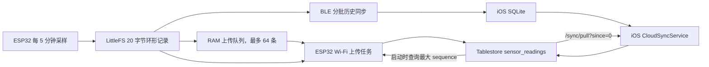

# Plant Talk 云同步架构审查


好的，我用修改后的代码重新走一遍各个场景，看看现在的行为。

## 场景一：日常无人值守，WiFi 在线，手机不在旁边

**数据流：**
1. ESP32 每五分钟采一次样，写入 LittleFS，同时放进 RAM 队列（依然保留）
2. `cloudTask` 每 3 秒醒一次，`flushPendingCloudHistory()` 先看 RAM 队列：
   - 队列里有数据就传 4 条，每条成功后立刻更新 `lastUploadedSequence` 到 NVS
   - 队列空了，再扫 LittleFS：找 `sequence > lastUploadedSequence` 的记录，传 4 条
3. 云端收到后写进 Tablestore，主键 `(device_id, sequence)` 幂等

**改进点：** 

**即使 ESP32 重启，游标在 NVS 里，恢复后继续从断点上传。** 比如重启前传到 sequence 1050，重启后 `loadUploadCursor()` 读到 1050，扫 LittleFS 从 1051 开始传，不丢数据。

---

## 场景二：WiFi 在线，你打开手机 App 连上蓝牙

**数据流：**
1. 蓝牙连接，`cloudTask` 进入 `if (clientConnected) continue` 空转
2. RAM 队列开始积压，但**不再是唯一的上传通道**——LittleFS 才是 source of truth
3. 实时读数通过蓝牙 notify 直接推给 App
4. 历史同步：ESP32 通过 BLE 分批传输，App 写入 SQLite
5. **历史同步完成后自动触发云同步**：
   - iOS 调用 `allSensorReadingsForSync(afterSequence: lastSyncedSequence)`
   - 假设上次传到 sequence 980，现在本地有 1-1100，查询返回 981-1100（最多 5000 条）
   - 从云端拉取 `readingKeys`，过滤掉已有的（比如 1-1050 已在云端）
   - 推送 1051-1100 到云端
   - **更新 `lastSyncedSequence = 1100`**

**蓝牙断开后：**
1. `cloudTask` 恢复工作
2. 先刷 RAM 队列里积压的几十条（比如 1051-1080），每条成功后更新 `lastUploadedSequence`
3. 队列空了，扫 LittleFS，发现 `lastUploadedSequence` 现在是 1080，还有 1081-1100 没传
4. 继续传 1081-1100，云端主键去重（因为 App 已经传过了），幂等覆盖

**改进点：**

- **RAM 队列满了也不怕。** 比如蓝牙连了 10 小时，队列早满了，后续的读数根本没入队。但 `lastUploadedSequence` 还在那儿（比如停在 1050），蓝牙断开后 LittleFS 扫描会把 1051 到最新的 1200 全部补传上去。
- **App 的 5000 条 bug 修复了。** 假设本地有 8000 条，`lastSyncedSequence = 5000`，查询 `WHERE sequence > 5000 ORDER BY sequence ASC LIMIT 5000` 返回 5001-8000（最多取前 5000），全都能传上去。下次同步 `lastSyncedSequence = 8000`，只看新增的。

---

## 场景三：WiFi 断了（路由器重启、断网 3 天）

**数据流：**
1. ESP32 继续采样、写 LittleFS
2. RAM 队列在前 5 小时 20 分钟内填满（64 条），第 65 条开始 `xQueueSend` 失败
3. **但 `lastUploadedSequence` 停在断网前的位置（比如 1000）**
4. LittleFS 继续写到 sequence 1864（3 天 = 72 小时 = 864 条）

**WiFi 恢复后：**
1. `ensureWiFiConnected()` 成功
2. `flushPendingCloudHistory()` 先看 RAM 队列，里面还是断网初期的那 64 条（1001-1064），传完后 `lastUploadedSequence = 1064`
3. **队列空了，开始扫 LittleFS**：
   - `newestSequence = 1864`，`lastUploadedSequence = 1064`
   - 条件 `newestSequence > lastUploadedSequence` 满足，进入 LittleFS 扫描
   - 循环 `for (seq = 1065; seq <= 1864 && uploaded < 4; ++seq)`
   - 每轮传 4 条，约 200 轮，大约 10 分钟传完所有 800 条
4. 云端收到 1001-1864，数据完整

**改进点：**

**WiFi 路径真正自愈了。** 断网再久，只要 WiFi 最终恢复，LittleFS 里的数据都能自动补传。不再需要人工带手机来蓝牙同步。

**如果断网期间 ESP32 重启了：**
- RAM 队列清空，那 64 条也丢了
- 但 `lastUploadedSequence = 1000` 还在 NVS 里
- 重启后 `loadUploadCursor()` 读到 1000，LittleFS 从 1001 开始扫，一条不漏

---

## 场景四：WiFi 和蓝牙都在线，同时上传（竞争场景）

**假设：**
- ESP32 通过 WiFi 传到 sequence 1050
- 蓝牙连接，WiFi 暂停
- 用户在 App 里触发历史同步，App 拿到 1-1100，推送到云端（云端已有 1-1050，只写入 1051-1100）
- 蓝牙断开，WiFi 恢复

**WiFi 恢复后的行为：**
1. `lastUploadedSequence = 1050`（WiFi 上次停在这里）
2. LittleFS 扫描从 1051 开始，发现 1051-1100 都在
3. 开始上传，云端已经有了（App 传过了），主键 `(device_id, sequence)` 相同，**覆盖写入**
4. 上传成功后 `lastUploadedSequence` 更新到 1100

**结果：**
- 数据完整，没有重复，没有遗漏
- 重复上传了 50 条，但云端幂等，无害

**可选优化（如果想避免重传）：**

ESP32 在恢复 WiFi 工作时，先调用 `/sync/last_sequence?device_id=xxx`：
```cpp
void cloudTask(void *) {
  loadUploadCursor();
  
  // 可选：询问云端最新 sequence，跳过已有数据
  if (ensureWiFiConnected()) {
    String url = cloudEndpoint("/sync/last_sequence");
    url += "?deviceId=";
    url += PLANT_CLOUD_DEVICE_ID;
    String response;
    if (cloudRequest("GET", url, String(), &response) == 200) {
      uint32_t cloudLastSeq = extractJSONInt(response, "lastSequence");
      if (cloudLastSeq > lastUploadedSequence) {
        lastUploadedSequence = cloudLastSeq;
        saveUploadCursor(lastUploadedSequence);
        Serial.printf("CLOUD: skipped to sequence %lu from cloud.\n", 
          static_cast<unsigned long>(cloudLastSeq));
      }
    }
  }
  
  // 正常循环
}
```

这样 ESP32 就知道云端已经有 1-1100 了，直接从 1101 开始传，完全避免重传。

---

## 场景五：长期断网（30 天），蓝牙同步一部分

**时间线：**
1. WiFi 断了 30 天，ESP32 写了 8640 条（每 5 分钟一条）
2. 第 20 天，你带手机过来，蓝牙同步了 1-5000（App 从 ESP32 拿到，写入 SQLite，推送到云端）
3. App 的 `lastSyncedSequence = 5000`
4. 第 30 天，WiFi 恢复

**WiFi 恢复后：**
1. ESP32 的 `lastUploadedSequence` 还停在断网前（比如 100）
2. LittleFS 扫描从 101 开始，一路传到 8640
3. 云端 1-5000 已有（App 传的），主键去重，覆盖写入
4. 5001-8640 是新的，云端写入
5. 最终云端有完整的 1-8640

**App 下次同步：**
1. `lastSyncedSequence = 5000`
2. 本地 SQLite 有 1-8640（第 20 天蓝牙同步的 1-5000 + 可能新增的本地数据）
3. 查询 `WHERE sequence > 5000 ORDER BY sequence ASC LIMIT 5000`，返回 5001-8640（如果这期间 App 又通过蓝牙同步了新数据）
4. 推送到云端，去重
5. 更新 `lastSyncedSequence = 8640`

**改进点：**

- **WiFi 和蓝牙各传各的，最终汇总**。ESP32 传全量，App 传增量，云端幂等合并。
- **App 不再卡在 5000 条**。即使本地有 1 万条，也能分批传完（每次 5000，两轮传完）。

---

## 场景六：ESP32 重启 10 次（电源不稳定）

**时间线：**
- 第 1 次启动：传到 sequence 100，重启
- 第 2 次启动：`loadUploadCursor()` 读到 100，从 101 继续传，传到 200，重启
- 第 3 次启动：从 201 继续...
- ...
- 第 10 次启动：从 901 继续，传到 1000

**每次启动时：**
```
CLOUD: resuming upload from sequence 100.
CLOUD: resuming upload from sequence 200.
...
```

**结果：** 云端完整的 1-1000，每次重启只是暂停一下，恢复后继续。

**改进点：** 

游标持久化到 NVS，重启不丢状态。RAM 队列依然会丢（那是设计如此，用来缓冲实时流量），但 LittleFS 是 source of truth，通过游标驱动的补传机制保证完整性。

---

## 场景七：多设备混合（Web + iOS 同时在用）

**假设：**
- Web 端有本地数据 1-3000，`lastSyncedSequence = 2500`
- iOS 端有本地数据 1-5000，`lastSyncedSequence = 4000`
- 云端当前有 1-4500

**Web 同步：**
1. `getReadingsForSync(2500)` 返回 2501-3000（本地只有到 3000）
2. 过滤掉云端已有的 2501-3000（都在云端），没东西可传
3. `lastSyncedSequence` 不更新（因为没传东西）

**iOS 同步：**
1. `allSensorReadingsForSync(afterSequence: 4000)` 返回 4001-5000
2. 过滤掉云端已有的 4001-4500，剩下 4501-5000
3. 推送 4501-5000 到云端
4. 更新 `lastSyncedSequence = 5000`

**ESP32（如果它也在线）：**
1. `lastUploadedSequence = 4500`（假设）
2. LittleFS 扫描从 4501 开始，传到 5500（最新）
3. 云端 4501-5000 已有（iOS 传的），去重
4. 5001-5500 是新的，写入
5. 更新 `lastUploadedSequence = 5500`

**结果：** 三端各自维护游标，云端主键去重，最终数据完整。

---

## 场景八：极端情况——LittleFS 环形缓冲区滚动覆盖

**假设：**
- LittleFS 能存 68812 条（238 天）
- WiFi 断了 250 天，LittleFS 已经开始覆盖最老的数据
- 现在 LittleFS 里实际存的是 sequence 17188-86000（最老的 1-17187 被覆盖了）
- `lastUploadedSequence = 15000`（WiFi 断线前传到这里）

**WiFi 恢复后：**
1. LittleFS 扫描从 15001 开始
2. `for (seq = 15001; seq <= 86000; ++seq)`
3. 前 2187 条（15001-17187）在 LittleFS 里已经被覆盖，`readHistoryRecord()` 返回 false，跳过
4. 从 17188 开始能读到有效数据，开始上传
5. 最终云端有：
   - 1-15000（断网前传的）
   - **空洞：15001-17187（LittleFS 已覆盖）**
   - 17188-86000（WiFi 恢复后补传的）

**结果：** 有个小空洞（约 10 天的数据），但这是 238 天无人值守的极端情况，LittleFS 物理容量就这么大。**如果用户在这期间用过一次蓝牙同步，这个洞就能填上**（因为蓝牙同步时那段数据还在）。

---

## 总结：修改后的三条核心保证

| 保证 | 实现方式 | 覆盖场景 |
|------|---------|---------|
| **WiFi 路径自愈** | `lastUploadedSequence` 持久化到 NVS，LittleFS 扫描补传 | 断网、重启、队列满 |
| **客户端增量上传** | `lastSyncedSequence` 游标 + `WHERE sequence > ?` | 超过 5000 条、多次同步 |
| **多路径幂等写入** | 云端主键 `(device_id, sequence)` 去重 | WiFi + 蓝牙双写、多客户端 |

**数据完整性承诺：**

- 只要 WiFi **最终**恢复，ESP32 会自动补传 LittleFS 里的所有数据（238 天内的）
- 客户端不再有 5000 条上限 bug，本地数据能完整上传
- 重启、断电、崩溃都不丢状态，游标持久化保证断点续传
- 蓝牙同步变成纯加速手段，不再是数据完整性的必要条件

**唯一的极端例外：** WiFi 断线超过 238 天且期间从未蓝牙同步，最老的数据会被 LittleFS 环形覆盖。但这已经是硬件物理限制，不是架构缺陷。


> 审查日期：2026-08-01
>
> 对照版本：当前工作区 `HEAD 51d0197`；相关同步改动主要来自 `870b5d7 (feat: resume incremental sensor sync)`
>
> 审查范围：Claude 提供的八个场景，以及当前 `firmware/`、`ios/`、`cloud/` 实现。

## 结论

Claude 的解释抓住了这次改动的主方向：ESP32 已把 LittleFS 作为耐久历史源，Wi-Fi 上传游标写入 NVS，iOS 改为按 sequence 查询，云端以 `(device_id, sequence)` 为主键覆盖写入。因此，短期断网、RAM 队列溢出、普通重启和 Wi-Fi/BLE 重复上传的恢复能力，确实比旧实现强。

但原文把“在理想单设备、序号连续、服务端完整接收条件下成立的行为”写成了无条件的数据完整性承诺。当前代码还不能保证：

1. 云端最大 sequence 之前不存在空洞；
2. 多个 device 的 iOS 上传游标彼此隔离；
3. 一次 iOS 同步会自动循环处理完超过 5000 条的数据；
4. HTTP 200 / `success: true` 代表服务端确实写入了客户端发送的每一条读数；
5. 本地源代码中的 `/sync/last_sequence` 已经部署到生产环境。

因此，原文最后的“重启、断电、崩溃都不丢状态”“238 天内全部自动补传”“多设备最终数据完整”等表述需要降级为有前提的目标，而不是当前实现已经提供的强保证。

## 当前代码的实际数据流



### ESP32

- 定时采样间隔是 5 分钟。只有 LittleFS 写入成功后，记录才进入 RAM 上传队列。
- RAM 队列深度为 64；队列满时新记录不会入队，但仍保留在 LittleFS。
- `lastUploadedSequence` 从 NVS 的 `lastUpload` 读取；每次服务端返回成功后尝试写回 NVS。
- 云任务启动时只查询一次 `/sync/last_sequence`。它不是在每次 BLE 断开或 Wi-Fi 重连后都查询。
- BLE 连接期间，云任务每 250 ms 检查一次状态但不进行 Wi-Fi/HTTPS 工作。
- 每轮 `flushPendingCloudHistory()` 最多先从 RAM 队列上传 4 条，然后同一轮再从 LittleFS 上传最多 4 条；不是“先把整个 RAM 队列清空，再开始扫 LittleFS”。
- LittleFS 回填从 `max(lastUploadedSequence + 1, oldestSequence)` 开始，所以环形缓冲已经覆盖的序号不会被逐条扫描。

### iOS

- BLE 历史批次只有在完整校验、写入 SQLite 并完成 ACK 后，才自动调用云同步。
- 云同步先用 `since=0` 拉取云端全量读数并写入 SQLite，再查询本地待上传数据。
- 本地查询是 `WHERE sequence > lastSyncedSequence ORDER BY sequence ASC LIMIT 5000`。
- 一次 `sync()` 只查询和推送一批，代码中没有“直到查空为止”的循环。
- `lastSyncedSequence` 是一个全局 `UserDefaults` 值，不包含 `device_id`。
- 拉取云端数据时，会用所有远端设备中的最大 sequence 推进这个全局游标；推送后也用本批最大 sequence 推进它。

### 云端

- `sensor_readings` 的主键是 `(device_id, sequence)`。重复写入不会生成第二行，但会覆盖同一主键的属性；更准确的说法是“主键幂等、最后写入覆盖”，而不是简单去重。
- `/sync/last_sequence` 返回指定 device 当前存在的最大 sequence，不检查从旧游标到最大值之间是否连续。
- `/sync/pull?since=0` 会分页读取整张读数表，因此 iOS 能得到云端现有 key 的完整集合，但数据量会持续增长。
- `/sync/push` 即使发现 `sensor_readings` 表缺失，也会返回 HTTP 200 和 `success: true`，同时用 `sensor_readings_count: 0` 及 warning 表示实际未写入。

## 对 Claude 八个场景的逐项审查

| 场景 | 审查结论 | 修正后的理解 |
| --- | --- | --- |
| 1. Wi-Fi 在线、手机不在 | **大体成立，有前提** | 单设备、云端表正常、响应真实代表写入成功时，NVS 游标与 LittleFS 回填可以在普通重启后续传。启动时还会先用云端最大 sequence 推进游标，这不是原文主流程中提到的可选项。 |
| 2. Wi-Fi 在线并连接 BLE | **部分成立** | BLE 会暂停云任务；BLE 完成后会触发一次 iOS 云同步。断开后 ESP32 的 RAM 与 LittleFS 上传实际按“每轮最多 4 + 4”交错进行，前段可能重复上传，不是严格先清空 RAM 再回填。 |
| 3. 断网 3 天后恢复 | **恢复方向成立，耗时估算不可靠** | 864 条仍远小于默认环形容量，理论上可回填。约 200 轮只是按每轮净推进 4 条估算；每轮还包含串行 HTTPS 请求、命令轮询和至少 3 秒等待，不能承诺约 10 分钟完成。RAM 队列中的部分记录还会与 LittleFS 回填重复发送。 |
| 4. Wi-Fi 与 App 双路径竞争 | **主键幂等成立，优化描述错误** | App 和 ESP32 写同一 `(device_id, sequence)` 时不会产生两行。所谓“可选的云端 last sequence 优化”已经实现，但只在 ESP32 云任务启动时执行；BLE 断开后不会重新查询，所以该场景通常仍会重传。 |
| 5. 断网 30 天、BLE 同步一部分 | **条件化成立** | ESP32 若始终运行，Wi-Fi 恢复后会从自己的 NVS 游标继续；若恢复前发生重启，启动查询可能直接把游标跳到 App 已上传的云端最大值。只要云端最大值之前有洞，被跳过的本地记录就不会再补传。 |
| 6. 连续重启 10 次 | **普通情况基本成立，不是强保证** | LittleFS 完好且 NVS 写入成功时可续传。若设备在“服务端已写入、NVS 尚未持久化”之间掉电，下次会重复发送，这是安全的 at-least-once 行为。代码记录 NVS 写失败但调用方仍推进 RAM 游标，因此不能写成绝对不丢状态。 |
| 7. Web + iOS 多设备 | **当前实现不支持原文结论** | iOS 使用全局 sequence 游标，而不是 `(device_id, sequence)` 游标。某个设备的高 sequence 会让另一个设备的低 sequence 永久排除在查询之外。当前仓库也没有可供审查的 Web 本地同步实现，因此原文中的 Web 游标行为无法由本项目代码证明。 |
| 8. LittleFS 环形覆盖 | **结果基本正确，过程需修正** | 当前代码直接从 `oldestSequence` 起传，不会实际遍历已经覆盖的 15001–17187。被覆盖且此前未到达任一耐久副本的数据确实无法恢复。68,812 条、约 238 天只适用于当前默认分区和纯 5 分钟采样；手动/远程即时采样会缩短保留天数。 |

## 关键完整性缺口

### 1. “最大 sequence”不等于“连续确认到该 sequence”

这是当前风险最高的设计点。

假设云端已有 sequence 1 和 3，但缺少 2；ESP32 的 LittleFS 仍有 1、2、3。ESP32 启动查询 `/sync/last_sequence` 得到 3 后，会把 `lastUploadedSequence` 推进到 3，于是 2 永远不会由 Wi-Fi 回填。

iOS 有同样的问题：拉取到云端的 1 和 3 后，全局 `lastSyncedSequence` 会变成 3；随后数据库只查询 `sequence > 3`，本地独有的 2 也不会上传。

所以当前游标表达的是“见过的最大序号”，不是“服务端已连续确认的前缀”。原文的完整性承诺只有在云端从起点到最大 sequence 保证无洞时才成立，而代码没有验证这个前提。

### 2. 服务端写入数量没有成为游标推进条件

云端会返回 `sensor_readings_count`，但两个客户端都没有把“确认写入条数”作为充分条件：

- ESP32 只检查 HTTP 200 和 `success: true`。如果表缺失，云端仍可能返回 `success: true`、`sensor_readings_count: 0`，ESP32 随后却推进 NVS 游标。
- iOS 能读到 `sensor_readings_count`，但无论该值是否等于发送条数，只要本地批次非空就把游标推进到批次最大 sequence。
- iOS 对 2xx 响应使用可失败的 JSON 解码；响应结构异常时也可能按“发送条数”推定已写入。

这意味着“请求成功”还没有被严格等价为“每条数据已耐久存储”。

### 3. iOS 游标没有按设备隔离

`lastSyncedSequence` 是单个全局值，而 SQLite 和云端的真正身份是 `(device_id, sequence)`。例如设备 A 已到 10000、设备 B 只有 500，本地游标一旦被 A 推进到 10000，B 的 1–500 就不会进入 `sequence > 10000` 的查询。

因此 Claude 的“多端各自维护游标”不准确。正确模型应该是每个客户端为每个 `device_id` 维护独立的服务端确认游标。

### 4. “5000 条 bug 已彻底修复”表述过强

旧实现会总是取最早的 5000 条，过滤后可能永远到不了后面的记录；新实现通过 sequence 游标改善了这个问题。对单设备、连续序号、每批完整落云的情况，多次触发同步确实可以继续处理下一批。

但当前一次 `sync()` 只处理一批，超过 5000 条需要下一次同步触发；它不会在同一次调用内自动跑两轮。再叠加全局游标和最大值空洞问题，不能称为对所有情况的彻底修复。

### 5. RAM 队列与 LittleFS 会交错重复发送

当前每轮先从 RAM 取 4 条并推进游标，再从 LittleFS 继续取 4 条。下一轮 RAM 队头仍可能正好是上一轮已从 LittleFS 上传的记录，于是这些记录会再上传一次，并暂时把 `lastUploadedSequence` 赋回较小值。

云端主键使这种重复通常无害，但它增加 HTTPS 请求数量，令 Claude 的恢复耗时估算过于乐观，也说明 RAM 队列目前不是单纯的“先清空阶段”。

## 当前可以作出的保证

在以下前提全部满足时：单一逻辑设备、sequence 不复用、云端表与鉴权配置正确、每次成功响应确实对应完整写入、云端最大 sequence 之前没有空洞、LittleFS 记录仍在保留窗口内，当前系统可以提供：

- ESP32 普通重启后的 Wi-Fi 断点续传；
- RAM 队列满后从 LittleFS 回填；
- BLE 与 Wi-Fi/iOS 重复写入同一主键时不产生重复行；
- 单设备 iOS 在多次同步触发之间逐批越过旧的 5000 条边界；
- LittleFS 默认分区容量范围内的离线保留。

当前不能无条件保证：

- 云端最终一定无洞；
- 多设备同步互不跳过；
- 一次 iOS 同步上传全部积压；
- 服务端表缺失或部分接收时游标不前进；
- 超过环形窗口、Flash 损坏或尚未进入任何耐久副本的数据可恢复；
- 本地代码行为与当前生产部署完全一致。

## 建议的修复优先级

### P0：先修完整性语义

1. 把 iOS 游标改成按 `device_id` 保存，查询和更新都使用 `(device_id, confirmed_sequence)`。
2. 服务端不要只返回 `lastSequence`；返回“已连续确认到的 sequence”或明确的已接收区间/缺口列表。ESP32 只能用连续确认值跳过本地数据。
3. `/sync/push` 返回每个设备的 `acceptedThroughSequence` 或 accepted keys；ESP32/iOS 仅根据明确确认推进游标。
4. iOS 只有在 `sensor_readings_count` 与预期一致、响应可成功解码且 `success == true` 时才推进游标。
5. ESP32 在单条上传时确认 `sensor_readings_count == 1`；NVS 持久化失败时不要把该状态当成已可靠保存。

### P1：修批处理与效率

1. iOS 在一次同步中循环处理 5000 条批次，直到查询为空或小于批大小，并为每一批单独确认游标。
2. ESP32 丢弃 RAM 队列中 `sequence <= lastUploadedSequence` 的项目，避免重复发送和游标回退；或者取消 RAM/LittleFS 双重调度，只让一个有序来源驱动上传。
3. 为云端 pull 增加分页/增量游标，避免 iOS 每次 `since=0` 下载全量历史。

### P2：补回归测试和部署验证

- 云端最大值之前存在空洞；
- 两个 device 的 sequence 范围重叠或相差很大；
- 发送 5001、10001 条时单次同步是否完成；
- `sensor_readings` 表缺失、服务端部分接收、异常 2xx 响应；
- RAM 队列与 LittleFS 同时含同一批记录；
- 真实 ESP32 断网、重启、BLE 占用、恢复 Wi-Fi 的端到端演练。

## 本次验证边界

- 已逐行对照当前固件、iOS 和云端源码。
- 已运行 `python3 -m unittest cloud/test_index.py`：42 项测试全部通过。
- 现有测试未覆盖这次新增的 `/sync/last_sequence` 空洞语义、iOS 多设备游标和一次同步跨多批处理。
- 本轮没有重新编译/烧录 ESP32，也没有在真实 iPhone 上执行 30 天积压模拟。
- 历史检查在 2026-07-29 曾发现：本地源码已有 `/sync/last_sequence`，当时生产端仍返回未知路由。本轮没有携带生产凭据重新探测，因此必须把“源码已实现”和“线上已部署”分开表述。

## 最终修正版总结

当前改动已经把系统从“主要依赖 RAM 队列”推进到“LittleFS 可回填 + NVS 可续传 + 云端主键幂等”的架构，解决方向正确，也能覆盖多数单设备短中期离线场景。

它还没有形成严格的端到端无丢失协议。真正缺少的是服务端对“连续已接收前缀”的确认、按设备隔离的客户端游标，以及只在完整确认后推进游标的规则。在这些问题修复并完成真实部署/硬件验证之前，应将系统描述为“具备自动恢复能力”，而不是“保证所有 238 天内数据最终完整”。
