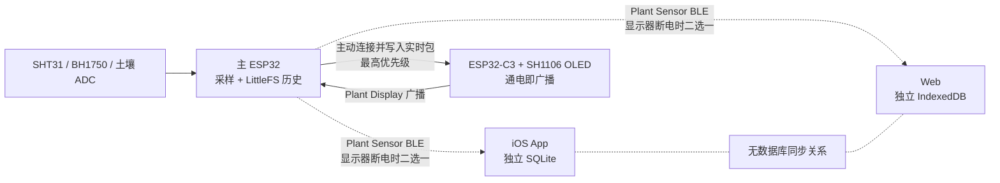
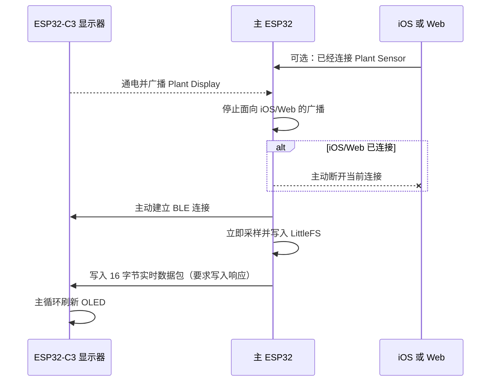

# Plant Talk `codex/no_cloud` 设计架构与实现总结

> 文档日期：2026-08-01
>
> 根仓库分支：`codex/no_cloud`
>
> Web 子仓库分支：`codex/no_cloud`
>
> 适用范围：iOS App、Web、主 ESP32、ESP32-C3 OLED 显示端

## 1. 目标

该分支采用本地优先、端间隔离的运行方式：

1. iOS 使用自己的本地 SQLite 数据库。
2. Web 使用自己的浏览器 IndexedDB 数据库。
3. iOS 与 Web 不通过云端交换数据，也不共享数据库。
4. 主 ESP32 不使用 Wi-Fi/云端采样或上传，传感器历史保存在 LittleFS。
5. iOS、Web 和 ESP32-C3 显示器都是独立端；主 ESP32 任意时刻只允许一个端占用数据连接。
6. ESP32-C3 显示器具有最高连接优先级：显示器一通电，主 ESP32 就主动连接它，并断开已经连接的 iOS/Web。

旧的 [cloud_sync_arch.md](./cloud_sync_arch.md) 描述云同步模式及其历史审查，不代表本分支的默认运行架构。

## 2. 系统总览



核心关系：

- 主 ESP32 是传感器数据的现场源和历史源。
- iOS 与 Web 分别保存自己通过 BLE 获得的数据。
- ESP32-C3 只负责显示，不保存完整历史。
- C3 通电时，主 ESP32 不再接受 iOS/Web 连接。

## 3. 数据所有权与数据库隔离

### 3.1 iOS

默认数据库位置：

```text
Application Support/PlantTalk/plant-talk-no-cloud.sqlite
```

实现入口：

- `ios/PlantTalkBLE/PlantDatabase.swift`
- `PlantDatabase.makeDefault()` 明确创建 `plant-talk-no-cloud.sqlite`。

隔离规则：

- 原来的 `plant-talk.sqlite` 不会被覆盖、合并或自动迁移。
- 切换到本分支不会把旧云同步数据库的数据带进新数据库。
- iOS 的会话、消息、传感器历史和同步游标都只作用于这份新 SQLite。

### 3.2 Web

Web 使用两份新的 IndexedDB：

| 用途 | 数据库名 | 实现文件 |
|---|---|---|
| 会话、消息、传感器读数等 | `plant-talk-web-no-cloud` | `web/lib/db/plant-db.ts` |
| 植物图像/作品 | `plant-talk-artwork-no-cloud` | `web/lib/db/plant-artwork.ts` |

隔离规则：

- 原来的 `plant-talk-web` 和 `plant-talk-artwork` 不会被复用。
- Web 不读取 iOS SQLite，也不与 iOS IndexedDB 共享任何存储。
- 没有自动导入旧数据库的迁移逻辑。

### 3.3 云同步边界

三个运行面的处理方式不同：

| 运行面 | 默认状态 | 实际限制 |
|---|---|---|
| 主 ESP32 | 完全关闭 | `PLANT_CLOUD_ENABLED` 固定为 `0`，即使旁边存在 `CloudConfig.h` 也不会编译 Wi-Fi/云代码 |
| Web | 完全关闭 | 云同步路由、同步模块、调用入口和相关测试已移除 |
| iOS | 默认关闭 | `AI 设置 → 云同步设置` 顶部 Toggle 默认为关闭；关闭时同步和云端远程采样均被拒绝 |

iOS 为兼容旧部署仍保留云同步实现。只有用户手动打开 Toggle 后，iOS 才会使用所填 URL 和 Token 访问云端；这属于显式例外。若要维持严格的 no-cloud 状态，应保持 Toggle 关闭。

相关实现：

- `ios/PlantTalkBLE/AISettingsView.swift`
- `ios/PlantTalkBLE/CloudSyncService.swift`
- `ios/PlantTalkBLE/PlantRemoteSampling.swift`
- UserDefaults 键：`plant_talk_cloud_sync_enabled`

## 4. BLE 角色与单端连接规则

### 4.1 正常角色

| 设备 | BLE 角色 | 行为 |
|---|---|---|
| 主 ESP32 | Peripheral/Server | 面向 iOS 或 Web 广播 `Plant Sensor` 服务 |
| iOS | Central/Client | 扫描并连接 `Plant Sensor` |
| Web | Central/Client | 通过 Web Bluetooth 连接 `Plant Sensor` |
| ESP32-C3 | Peripheral/Server | 通电后持续广播专用 `Plant Display` 服务 |
| 主 ESP32 | Central/Client | 同时扫描 `Plant Display`，发现后主动连接 C3 |

主 ESP32 同时具备 BLE Server 与 BLE Client 能力，但业务层只允许一个独立端占用连接。

### 4.2 C3 强制优先流程



C3 断电或复位后：

1. 主 ESP32 收到断开事件。
2. 主 ESP32 重新开始扫描 C3。
3. 延迟约 250 ms 后恢复面向 iOS/Web 的广播。
4. C3 再次广播时，主 ESP32 重新抢占连接。

注意：C3 的 USB 串口被打开时会触发 `USB_UART_CHIP_RESET`，效果等同于 C3 短暂重启；主 ESP32 会自动完成断开、扫描和重连。

## 5. BLE 服务与数据协议

### 5.1 iOS/Web 使用的 `Plant Sensor` 服务

| 项目 | UUID | 属性/用途 |
|---|---|---|
| Service | `7A1E0001-7C6D-4A8B-9E1F-2D3C4B5A6000` | 主传感器服务 |
| Live Data | `7A1E0002-7C6D-4A8B-9E1F-2D3C4B5A6000` | Read + Notify，实时读数 |
| Control | `7A1E0003-7C6D-4A8B-9E1F-2D3C4B5A6000` | Write，历史/时间/立即采样命令 |
| History | `7A1E0004-7C6D-4A8B-9E1F-2D3C4B5A6000` | Notify，历史记录和批次结束包 |

### 5.2 C3 使用的 `Plant Display` 服务

| 项目 | UUID | 属性/用途 |
|---|---|---|
| Service | `7A1E1001-7C6D-4A8B-9E1F-2D3C4B5A6000` | 显示器发现与连接 |
| Live Data | `7A1E1002-7C6D-4A8B-9E1F-2D3C4B5A6000` | Write + Write Without Response，接收实时包 |

主 ESP32 当前使用带响应的 Write，把一次写入成功作为 C3 已接收数据的确认。

### 5.3 16 字节实时数据包

所有多字节数值采用 little-endian。

| 偏移 | 长度 | 类型 | 内容 |
|---:|---:|---|---|
| 0 | 1 | `uint8` | 协议版本，当前为 `1` |
| 1 | 1 | bit flags | `0x01`：SHT31 有效；`0x02`：BH1750 有效；`0x04`：时间为估算值 |
| 2 | 2 | `uint16` | 土壤湿度 ADC 原始值 |
| 4 | 4 | `float32` | 温度，摄氏度 |
| 8 | 4 | `float32` | 空气湿度，百分比 |
| 12 | 4 | `float32` | 光照强度，lux |

### 5.4 控制命令

| 命令 | 值 | 用途 |
|---|---:|---|
| `COMMAND_REQUEST_AFTER_SEQUENCE` | `0x10` | 从指定 sequence 后请求历史批次 |
| `COMMAND_ACKNOWLEDGE_SEQUENCE` | `0x11` | 客户端确认已持久化到指定 sequence |
| `COMMAND_SET_UNIX_TIME` | `0x12` | iOS/Web 向主控校准 Unix 时间 |
| `COMMAND_REQUEST_IMMEDIATE_SAMPLE` | `0x13` | 立即增加一次正常采样、历史写入和实时发布 |

### 5.5 20 字节历史包

历史记录、批次结束和失败响应都使用 20 字节格式，并使用 CRC-8/ATM 校验。批次结束包声明实际发送的首 sequence、末 sequence 和数量；客户端只有在收到的记录完整、连续且事务写入数据库成功后，才允许推进本地游标并发送 ACK。

## 6. 主 ESP32 数据链路

### 6.1 采样源

| 指标 | 硬件/引脚 |
|---|---|
| 温度、空气湿度 | SHT31，I²C 地址 `0x44` |
| 光照 | BH1750，I²C 地址 `0x23` |
| 土壤湿度 | ADC GPIO34，保存原始 12 位 ADC 值 |
| 主控 I²C | SDA GPIO21，SCL GPIO22 |

### 6.2 采样时机

- 常规定时采样：每 5 分钟一次。
- C3 建立连接：立即采样一次，让显示器无需等待下一个五分钟周期。
- iOS/Web 写入 `0x13`：立即采样一次。

每次正常采样都会：

1. 读取传感器。
2. 分配 sequence 和时间戳。
3. 写入 LittleFS 环形历史文件。
4. 更新 `Plant Sensor` 的 Live Data 值。
5. 若 C3 已连接，向 C3 写入同一个 16 字节实时包。

### 6.3 LittleFS 历史

- 文件：`/history.bin`
- 每条记录：20 字节
- 物理槽：`(sequence - 1) % historyCapacity`
- sequence 预留游标保存在 NVS，避免重启后复用已经出现过的 sequence。
- LittleFS 是主 ESP32 的耐久历史源；iOS/Web 数据库只是各自已经同步到本地的副本。

## 7. ESP32-C3 显示端

### 7.1 板卡参数

| 参数 | 当前实物 |
|---|---|
| 开发板 | ESP32-C3 Super Mini |
| 芯片 | ESP32-C3 AZ，QFN32，revision v1.1 |
| Flash | 4 MB，XMC `0x4016` |
| 硬件 MAC | `44:B1:76:1A:37:B4` |
| USB | Espressif USB JTAG/serial，VID `0x303A`，PID `0x1001` |
| 串口 | `/dev/cu.usbmodem101` |

### 7.2 OLED

| 参数 | 当前配置 |
|---|---|
| 分辨率 | 128 × 64，单色 |
| 控制器配置 | SH1106（U8g2） |
| I²C 地址 | `0x3C` |
| SDA | GPIO8 |
| SCL | GPIO9 |

最初按 SSD1306 驱动时，实物画面出现字体放大、显存错位以及类似“横条数字跳秒”的现象。当前固件根据该现象改用 U8g2 的 SH1106 128×64 驱动，并移除了每秒变化的数据包年龄计数器。

BLE 回调不直接操作 OLED：

1. BLE 回调把最新的 16 字节数据包写入长度为 1 的 FreeRTOS 队列。
2. Arduino 主循环取出最新包，解析四项数据。
3. 只有主循环操作 U8g2 和 I²C，避免 BLE host task 与主循环同时刷新屏幕。
4. 屏幕显示温度、空气湿度、光照和土壤 ADC；数值只在新采样到达时改变。

## 8. 关键源码

| 模块 | 文件 |
|---|---|
| 主 ESP32 固件 | `firmware/PlantSensorBLE/PlantSensorBLE.ino` |
| 主控硬件记录 | `firmware/PlantSensorBLE/HARDWARE_INFO.md` |
| C3 显示器固件 | `firmware/PlantDisplayC3/PlantDisplayC3.ino` |
| C3 使用说明 | `firmware/PlantDisplayC3/README.md` |
| iOS SQLite | `ios/PlantTalkBLE/PlantDatabase.swift` |
| iOS 云同步开关 | `ios/PlantTalkBLE/AISettingsView.swift` |
| iOS 同步守卫 | `ios/PlantTalkBLE/CloudSyncService.swift` |
| iOS 远程采样守卫 | `ios/PlantTalkBLE/PlantRemoteSampling.swift` |
| Web IndexedDB | `web/lib/db/plant-db.ts` |
| Web 图像 IndexedDB | `web/lib/db/plant-artwork.ts` |

## 9. 编译与烧录

### 9.1 主 ESP32

必须继续使用 `no_ota` 分区，避免改变当前 LittleFS 布局和历史数据区域。

```bash
arduino-cli compile \
  --fqbn esp32:esp32:esp32:PartitionScheme=no_ota \
  --build-path /tmp/plant-main-no-cloud-build \
  firmware/PlantSensorBLE

arduino-cli upload \
  -p /dev/cu.wchusbserial110 \
  --fqbn esp32:esp32:esp32:PartitionScheme=no_ota \
  --build-path /tmp/plant-main-no-cloud-build \
  --verify \
  firmware/PlantSensorBLE
```

### 9.2 ESP32-C3

```bash
arduino-cli compile \
  --fqbn esp32:esp32:esp32c3:CDCOnBoot=cdc \
  --build-path /tmp/plant-display-no-cloud-build \
  firmware/PlantDisplayC3

arduino-cli upload \
  -p /dev/cu.usbmodem101 \
  --fqbn esp32:esp32:esp32c3:CDCOnBoot=cdc \
  --build-path /tmp/plant-display-no-cloud-build \
  --verify \
  firmware/PlantDisplayC3
```

依赖的 Arduino 库：

- NimBLE-Arduino
- Adafruit SHT31
- BH1750
- U8g2

## 10. 已完成验证

### 10.1 编译与烧录

- 主 ESP32 和 ESP32-C3 均编译通过。
- 两块板均通过真实 USB 端口烧录。
- `esptool` 对各段写入均报告 `Hash of data verified`。
- 主 ESP32 保持 `no_ota` 分区，LittleFS 历史未因本次固件更新重新分区。

最近验证构建的应用镜像 SHA-256：

| 设备 | SHA-256 |
|---|---|
| 主 ESP32 | `de883ff9471240dcc66332a236abace2065cd0fb307deb46a0de20f250a797c7` |
| ESP32-C3（SH1106） | `a95df0d89db3941e7ac72ab6eb6b160001128d50d1e0757d9531669f46ee2f1b` |

### 10.2 实机连接

已验证以下完整链路：

1. C3 通电并广播 `Plant Display`。
2. 主 ESP32 发现 C3。
3. 主 ESP32 停止 iOS/Web 广播并主动连接 C3。
4. C3 复位后主控检测断线，恢复扫描，再次自动连接。
5. 主控立即采样并写入 C3。
6. C3 成功解析四项数据。

一次 SH1106 固件烧录后的串口样本：

```text
SH1106 OLED ACK at 0x3C on SDA=8 SCL=9.
Priority display BLE advertising started.
Main ESP32 connected from 8c:94:df:a1:c6:be.
Reading: temp=27.0 C humidity=58.0 % light=103 lx soil=3502 flags=0x03
```

`flags=0x03` 表示 SHT31 和 BH1750 两组读数均有效。

### 10.3 数据持久性

- 烧录主 ESP32 后，LittleFS 能恢复既有历史记录并继续递增 sequence。
- 在验证过程中的检查点，历史记录由 1214 条继续增加到 1216 条，没有被格式化。
- C3 每次重新连接触发的立即采样会新增一条正常历史记录。

## 11. 当前限制与使用约定

1. **显示器最高优先级**：C3 保持通电时，iOS/Web 无法连接主 ESP32；要使用 App 或浏览器 BLE，应先关闭 C3 电源。
2. **iOS Toggle 是显式例外**：严格 no-cloud 使用时必须保持关闭；Web 和主 ESP32 没有对应的云入口。
3. **端间不合并**：iOS 与 Web 各自看到的是自己曾经通过 BLE 获取的数据，双方不会自动一致。
4. **C3 不保存历史**：它只保留 RAM 中最后一条实时读数，重启后等待主控重新发送。
5. **重新连接会立即采样**：频繁打开 C3 串口或反复复位会在主控历史中增加额外样本。
6. **土壤值是 ADC 原始值**：当前没有在 C3 上换算为百分比，需要基于实际探头的干/湿标定值后才能可靠换算。
7. **OLED 视觉确认**：SH1106 固件的 I²C 初始化和数据解析已经由串口确认；最终画面方向、字号和对齐仍以实物屏幕观察为准。

## 12. 一句话总结

`codex/no_cloud` 把 Plant Talk 变成了一个以主 ESP32 LittleFS 为现场历史源、iOS/Web 各自独立本地持久化、C3 通电即强制优先显示的本地 BLE 系统；除非用户在 iOS 中显式打开云同步 Toggle，否则各端之间不存在云端数据通道。
